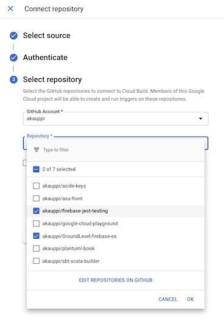
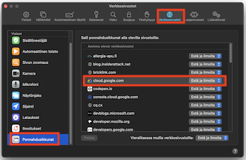
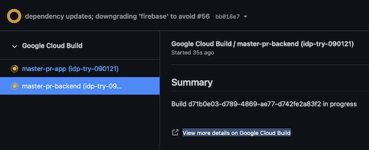

# CI setup

All command line commands are expected to be run in the `ci` folder.

## Aim 🎯

For a PR to `master`:

1. If files in `backend` (or root `package.json`, or `tools`) changed:
  - test `backend`
2. If files in `app` changed:
  - test `app`

For changes already merged to `master`:

1. If files in `backend` (or root `package.json`, or `tools`) changed:
  - deploy `backend`
2. If files in `app` or `app-deploy-ops` changed:
  - build `app`
  - build `app-deploy-ops`
  - deploy `app-deploy-ops`

>Note: With Cloud Build integrated with GitHub, one cannot restrict merges to `master` - only be informed after the fact. We can live with this, but needs some discipline.

<!-- author's note:

We'd like to:
- restrict merges to `master` altogether (#help: how is that possible?)
- have two people approve PRs
  - [ ] check what options GitHub itself provides
-->

## Requirements

- `gcloud`

   <details><summary>Installation on macOS</summary>
   Follow [Installing Google Cloud SDK](https://cloud.google.com/sdk/docs/install)
	
	After unpacking, move the folder to a permament location (author uses `~/bin/google-cloud-sdk`). The installation is on that directory only, and uninstalling means removing the directory.

   ```
   $ gcloud --version
	Google Cloud SDK 343.0.0
	...
   ```

   Update by: `gcloud components update`
	</details>

   <details><summary>Installation on Windows 10 + WSL2</summary>
   tbd.. `#contribute`
   </details>

- Docker

   Needed for building the builders.


### Set up a GCP project for CI/CD jobs

The model recommended by the author is such:

```
         xxxxxx                     ┌─────────────────────┐      ┌────────────────────────┐
    x   x     xxxx         deploy   │                     │      │                        │
  xxxxxxx         xxxxxx  ┌─────────┤   Application       │      │   CI/CD project        │
 xx    xx         x     x │         │   projects          │      │                        │   PR changed    GitHub repos
x       x                xxx        │                     ├───┬──┤   - builder images     ◄────────────────     - PRs
xx                         x        │   - deploy CI task  │   │  │   - PR CI tasks        │
 xx                     xxx         │                     │   │  │     "does it pass?"    ├───────────────►
  xxxxxxxxxxxxxxxxxxxxxxx           │                     │   │  │                        │   pass/fail
                                    └─────────────────────┘   │  └────────────────────────┘
                                                              │
                                    ┌─────────────────────┐   │
                                    │                     │   │              branch changed
                                    │   ...               │   │   ◄────────────────────────────────────────
                                    │                     ├───┤  
                                    └─────────────────────┘   │
                                                              │
                                    ┌─────────────────────┐   │
                                    │                     │   │
                                    │   ...               │   │
                                    │                     ├───┘
                                    └─────────────────────┘
```
<!-- drawing with Asciiflow -->

There is a single, CI/CD centric GCP project (e.g. `ci-builder`).

It...

- runs any "does this pass the tests?" CI tests (that don't need access rights to deploy)
- holds the custom Docker images used in the organization 
  - grants the other projects (below) access to its Container Registry

In addition, each GCP project (responsible for a certain product's certain tier, e.g. `swapper-staging`) has a CI/CD aspect:

- runs deployments, if the suitable branch changes.

This organization seems light enough, yet flexible, to recommend. In the following text we expect you have it in place.

>One benefit of the above model is that *deployment keys* don't need to be shared much (well, at all).

<!-- tbd. Separate (and link to):
Guidance on setting up the GCP projects.
-->


### Log in to the GCP project

To use `gcloud builds submit`, for example, you need to be logged in to the CI project. This can be either the central `ci-builder` or a product specific project - your call.

```
$ gcloud auth login
```

```
$ gcloud projects list
```

Pick the right one, then:

```
$ gcloud config set project my-project-id
```

<!-- whisper
Observe your current project by:

```
$ gcloud config get-value project
Your active configuration is: [...]
ci-builder-21
```
-->

### Build the Builders

The CI scripts require `ci-builder` Container Registry to have the following builder images:

- `firebase-emulators:9.12.1-node16-npm7`
- `firebase-emulators-cypress:9.12.1-7.5.0-node14-npm7`

<details><summary>Instruction for building and pushing them..</summary>

```
$ cd firebase-emulators.sub
$ ./build
$ ./push-to-gcr
  # agree with the prompt...
```

```
$ cd ../firebase-emulators-cypress.sub  # tbd.
```
<!-- tbd. check the instructions; THIS IS REALLY LEFT UNDONE!! -->
</details>


## GitHub Marketplace: enable Cloud Build application

- [Google Cloud Build](https://github.com/marketplace/google-cloud-build) (GitHub Marketplace) application > `Enable`
- Add your GitHub repo to the Cloud Build app (covers all GCP projects where Cloud Build is enabled)

You need this, in order to create Cloud Build triggers on GitHub PRs.

>Note: The UI uses the term "purchase", but installing the application is completely free (Jun 2021). The costs - if any - are based on your agreements with GitHub and Cloud Build.


## Cloud Build setup

You can either:

- use one GCP project for both deployment and CI tests
- use two GCP projects: one for CI tests, another one (or multiple) for deployments

The difference is marked in the table below, showing the details of setting up Cloud Build tasks. Execute the setup for each of these GCP projects.

### Enable APIs

- [GCP Console](https://console.cloud.google.com/home/dashboard) > `≡` > `APIs & Services`
- `+ Enable APIs and Services`

   

- `Cloud Build` > `Enable`

*Without this, you run into problems. Google's instructions did not mention this step, for some reason. (May 2021)*

Also check that the following are enabled:

  - Firebase Management API
  - Firebase Hosting API
  - Cloud Resource Manager API

<!-- from: https://cloud.google.com/build/docs/deploying-builds/deploy-firebase#before_you_begin
-->

### Steps for the deploying project

For the GCP project that handles deployment (author recommends the deployment project itself), in addition to the above, do these steps:

<details><summary>Grant Firebase IAM roles to the Cloud Build service account</summary>

- Google Cloud console > `Cloud Build` > `Settings`
- Change `Firebase Admin` to `Enabled`

>

There was one more role needed, not covered in the normal documentation. Deploying Cloud Functions needs this.

- Get the number from the "Service account email" (above screenshot).
- Using the Firebase project id:

   ```
   $ MEMBER=serviceAccount:337......369@cloudbuild.gserviceaccount.com
   $ PROJECT_ID=...
   $ gcloud iam service-accounts add-iam-policy-binding $PROJECT_ID@appspot.gserviceaccount.com --member=$MEMBER --role=roles/iam.serviceAccountUser
   Updated IAM policy for serviceAccount [...]
   ...
   ```

>Note:
>
>You may consider doing this on a *separate local account* to not need to log in as the production account, ever. Think of it as admin-level stuff.
>
>Q: Is there a way to do this on the Google Cloud Console? We'd rather give those instructions. `#help`

```
$ gcloud auth logout
```

>Note: Would changing the `Service Account User` in the screenshot have done the same? Likely. (tbd. test) 

<!-- whisper
Interestingly, the GUI does not change the state of `Service Account User` to `ENABLED` - maybe it contains more roles than the one we changed at the command line?
-->
</details>

<details><summary>Add "API Keys Admin" role to the Cloud Build service account</summary>

>*Note: [Deploying to Firebase](https://cloud.google.com/build/docs/deploying-builds/deploy-firebase) mentions this but the community Firebase builder `README` doesn't. Things might work without it, too?*

- Google Cloud console > `IAM & Admin`
- Spot `@cloudbuild.gserviceaccount.com` account on the list > <font size="+1.5">`✎`</font> (edit)
- Add the `API Keys Admin` role:

>
</details>


## Create the triggers

Finally, we can create the triggers we want to run in CI.

GCP Console > (project) > `Cloud Build` > `Triggers` > `+ Create Trigger`

>Note: These settings are *not* in the version control. The workflow relies on you to have set them up, appropriately. The suggested initial settings are below, to get you started.

### Run tests

For the GCP project responsible of running tests.

||`master-pr-backend`|
|---|---|
|Description|PR targets "master" with changes on the backend|
|Event|(●) Pull Request (GitHub App only)|
|**Source**|
|Repository|*pick (\*)*|
|Base branch|`^master$`|
|Comment control|(●) Required except for owners and collaborators|
|Included files filter (glob)|`packages/backend/**`, `package.json`, `tools/**`|
|Ignored files filter (glob)|`*.md`, `.images/*`|
|**Configuration**|
|Type|(●) Cloud Build configuration file (yaml or json)|
|Location|(●) Repository: `ci/cloudbuild.master-pr.backend.yaml`|

It makes sense to keep the name of the CI entry and the respective `yaml` file the same (but the name cannot have a `.`).

<p />

>
>
>*(\*): The `Connect New Repository` uses a popup to connect GitHub Cloud Build Application and the Cloud Build project, to access a certain repo. THIS DOES NOT WORK ON SAFARI (unless popups are enabled). Follow setup below or use eg. Chrome for connecting a repo.*
>
><details><summary>Allow popups on Safari for `cloud.google.com`</summary>
>
><ul>
>  <li>`Preferences` > `Websites` > `Pop-up Windows` (lowest in left pane)</li>
>  <li>`cloud.google.com`: `Allow`</li>
></ul> 
></details>

Screenshot of the actual dialog (UI things may change):

>

||`master-pr-app`|
|---|---|
|Description|PR that affects `packages/app`|
|Event|(●) Pull Request (GitHub App only)|
|**Source**|
|Repository|*pick*|
|Base branch|`^master$`|
|Comment control|(●) Required except for owners and collaborators|
|Included files filter (glob)|`packages/app/**`|
|Ignored files filter (glob)|`*.md`, `.images/*`|
|**Configuration**|
|Type|(●) Cloud Build configuration file (yaml or json)|
|Location|(●) Repository: `ci/cloudbuild.master-pr.app.yaml`|

>Hint: The easiest way to do the secondary triggers is `⋮` > `Duplicate`.

<p />

>Note: We consciously have omitted changes to (only) `package.json` (in the root) and `tools/**` from running app tests. These *may* affect that such tests would break but it's relatively unlikely. **Tests do not need to be perfect**; it's enough that they are useful.

These two CI steps now allow seeing the 🟢🟠🔴 status of pull requests that target `master`.

**Test it!**

Make a Pull Request in GitHub.

You should see these (under `Checks`):




<!-- #later (maybe move deployment stuff together???). tbd. check the details!!!

### Deploy

You may have 1..n deployment projects (eg. production and staging).

Each such would listen to a different branch of the GitHub repo.

Create these triggers in the project that gets deployed, itself. This way, you don't need to spread deployment rights. (blah-blah)

||**`master-merged`**|
|---|---|
|Description|Merge to `master`|
|Event|(●) Push to a branch|
|**Source**|
|Base branch|`^master$`|
|Included files filter (glob)|*empty*|
|Ignored files filter (glob)|`*.md`, `.images/*`|
|**Configuration**|
|Type|(●) Cloud Build configuration file (yaml or json)|
|Location|(●) Repository: `ci/cloudbuild.merged.yaml`|

The same CI step takes care of deploying both backend and app. 

>*tbd. We might revisit this later, but it's important that if both change, backend is updated first.*
-->

## Run CI jobs manually (`cloud-build-local`; doesn't work)

You are supposed to be able to use `cloud-build-local` to package files, and run locally like Cloud Build, but it does not seem to work.

```
$ cloud-build-local  --config=cloudbuild.master-pr.backend.yaml --dryrun=false ..
2021/06/06 20:01:31 Warning: The server docker version installed (20.10.6) is different from the one used in GCB (19.03.8)
2021/06/06 20:01:31 Warning: The client docker version installed (20.10.6) is different from the one used in GCB (19.03.8)
2021/06/06 20:02:34 Error copying source to docker volume: exit status 1
```

`cloud-build-local` seems to be pretty abandoned by Google, so the author looked further... 

>`#help`: Anyone know how to fix this?

## Run CI jobs manually II (`gcloud builds submit`)

This works (runs the build in the cloud; requires you to have logged into the GCP project):

```
$ gcloud builds submit --config=cloudbuild.master-pr.{app|backend}.yaml ..
```

```
$ gcloud builds submit --config=cloudbuild.merged.yaml ..
```

These commands pack the source files, and run the CI in the cloud. They save you from `git commit` and awkward PRs just for testing. :)

### See what is going out

It makes sense to optimize the "tarball" going out. Not shipping unnecessary files speeds your debug cycles, and also saves storage space (Cloud Build keeps these around). 

```
$ gcloud meta list-files-for-upload ..
```

This set of files is controlled by `.gcloudignore` in the project root.


## Maintenance: clean up the tarballs

*tbd. Where are they; what do we need to do?*

`#contribute` by suggesting text, maybe?? ;M


## References

- [Cloud Build](https://cloud.google.com/build/) (GCP)
- [Creating GitHub App triggers](https://cloud.google.com/build/docs/automating-builds/create-github-app-triggers) (Cloud Build docs)
- [Deploying to Firebase](https://cloud.google.com/build/docs/deploying-builds/deploy-firebase) (Cloud Build docs)
- [Building and debugging locally](https://cloud.google.com/build/docs/build-debug-locally) (Cloud Build docs)
- `gcloud builds submit --help`

