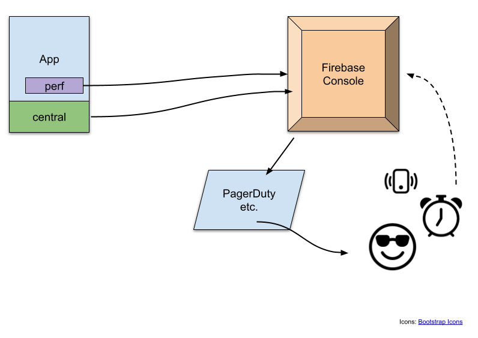

# Alerts

With logs, performance monitoring and [hosting logs](https://firebase.google.com/docs/hosting/web-request-logs-and-metrics, we are already shipping enough information to Firebase console and Cloud Logging, to have an idea of what's going on.

You can now harness the power of those systems to warn *you* if something unusual is happening.

>Note: There are third party ecosystems for alerting. They likely have integrations with Cloud Logging. The point is that they work off data *we already collect* and you don't need to support them in the `app-deploy-ops` code level.

*Image 1. Transforming logs and performance monitoring to alerts.*
<!-- source: https://docs.google.com/drawings/d/1zJnXhjRZq6Y2cDyUZr8QC-fuXVsYltBa4ejS0cKoStw/) -->

<!-- Editor's note:
WOuld we like to have a separate section on hosting logs?

-->

## Alert ecosystems

- [PagerDuty](https://www.pagerduty.com)
- [OpsGenie](https://www.atlassian.com/software/opsgenie)
- ...

These tools are meant for people "on call duty", so that *your* people would be solving a problem already before your users have reported it.

A good such tool would provide:

- a dedicate app for receiving alerts (and marking you're on it)
- chaining of people so there's backup if one doesn't pick an issue for some reason
- integration with not only logs but deployments, builds, source code version control

This is a whole different ball game, as you can imagine. The purpose of this repo is to leave you here. Knowing that you can build an alert ecosystem on top of the Cloud Logging and Firebase Performance Monitoring.

### The minimal setup

If you are not needing a whole alerts ecosystem (or don't already have one, provided by the team/company), here are basic (and free!) steps you can take:

- Set up availability monitoring

  [uptimerobot.com](https://uptimerobot.com) pings your web site every 5 min to see that it's there.
  

<!--  
tbd. Continue once we have ops experience..
-->

---

Next: <a href="README.5-support.md">Support forums</a>

